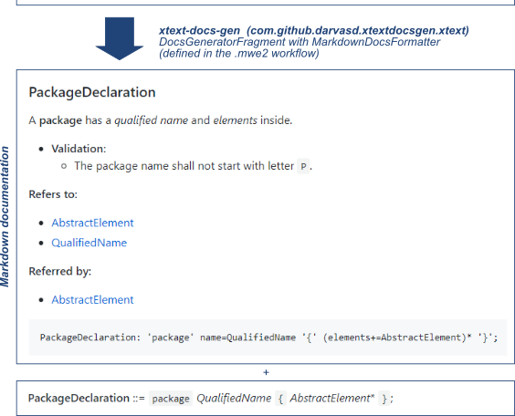
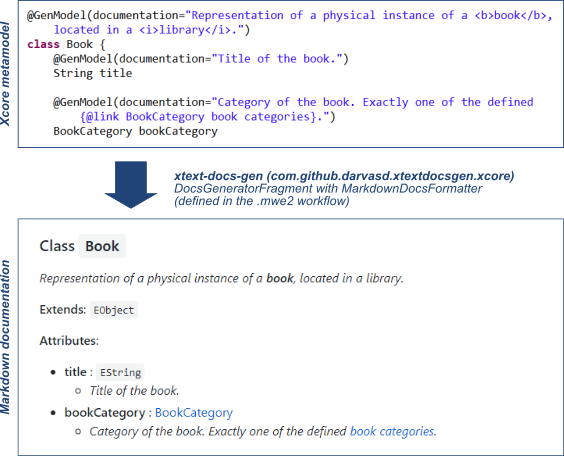

# xtext-docs-gen
A simple overview documentation generation for Xtext grammars.

## Xtext documentation generation
### Example
To get the gist of it, have a look at the example below, illustrating the documentation generation.



To check a more comprehensive example, see the [documentation](docs/ExampleDomainmodelDocs.md) generated for the [Domainmodel example grammar](examples/org.example.domainmodel/src/org/example/domainmodel/Domainmodel.xtext), using [this workflow file](examples/org.example.domainmodel/src/org/example/domainmodel/GenerateDomainmodel.mwe2).

### Usage
1. Add `com.github.darvasd.xtextdocs.xtext` as depencency to the `MANIFEST.MF` of your plug-in project containing the Xtext grammar.
   * You can use the http://darvasd.github.io/xtext-docs-gen/release/ update site to fetch it.
1. Add the documentation generation to your workflow description (`.mwe2` file next to your grammar), as a fragment for your language configuration (`XtextGeneratorLanguage` instance). For example:
   ```
	language = StandardLanguage {
	[...]
		// xtext-docs-gen
		fragment = DocsGeneratorFragment auto-inject {
			outputFileName = "docs.md"
			formatter = MarkdownDocsFormatter {
				includeSimplifiedGrammar = true
				mainTitle = "Title text" // optional
			}
		}
	[...]
	}
   ```
   
   You will need some imports:
   ```
   import com.github.darvasd.xtextdocs.xtext.fragment.DocsGeneratorFragment
   import com.github.darvasd.xtextdocs.xtext.formatter.MarkdownDocsFormatter
   ```
1. If you execute your workflow, the grammar documentation should be generated. You can see it in the log as well:
   ```
   ...
   5214 [main] INFO  text.fragment.DocsGeneratorFragment  - Generating grammar documentation
   5242 [main] INFO  text.fragment.DocsGeneratorFragment  - Grammar documentation using 'MarkdownDocsFormatter' written to 'docs.md' 
   ...
   ```
 
## Xcore metamodel documentation generation
### Example
To get the gist of it, have a look at the example below, illustrating the documentation generation.



To check a more comprehensive example, see the [documentation](docs/ExampleXcoreDocs.md) generated for the [Library example metamodel](examples/org.example.xcore/model/Library.xcore), using [this workflow file](examples/org.example.xcore/src/org/example/xcore/library/GenerateXcoreDocs.mwe2).

### Usage
1. Add `com.github.darvasd.xtextdocs.xcore` as depencency to the `MANIFEST.MF` of your plug-in project containing the Xcore metamodel(s).
   * You can use the http://darvasd.github.io/xtext-docs-gen/release/ update site to fetch it.
1. You will need in addition the following dependencies: ``
1. Create an MWE2 workflow description (`.mwe2` file) that will generate the Xcore documentation. Take [this]() as an example for the Xcore metamodel loading. For the documentation generation configuration, here is an example:
   ```
	language = StandardLanguage {
	[...]
		component = DocsGeneratorFragment {
			uri = "model/Library.xcore"
			outputFileName = "LibraryXcore.md"
			formatter = MarkdownXcoreDocsFormatter {
				mainTitle = "Library.xcore metamodel description"
				gitbookLinkStyle = true
				titleLevelOffset = "0" // optional
				showOriginalXcoreCode = true  // optional
				includeToc = true // optional
			}
		}
	[...]
	}
   ```
   
   You will need some imports:
   ```
   import com.github.darvasd.xtextdocs.xcore.fragment.DocsGeneratorFragment
   import com.github.darvasd.xtextdocs.xcore.formatter.MarkdownXcoreDocsFormatter
   ```
1. If you execute your workflow, the grammar documentation should be generated. You can see it in the log as well:
   ```
   ...
   3383 [main] INFO  core.fragment.DocsGeneratorFragment  - Xcore documentation using 'MarkdownXcoreDocsFormatter' written to 'LibraryXcore.md.' 
   ...
   ``` 
   
  
## Download

Use `https://darvasd.github.io/xtext-docs-gen/release/` as update site and install the _Xtext documentation generator_ or the _Xcore documentation generator_ plug-in.

## License

Copyright (c) 2018, 2019 Daniel Darvas

This program and the accompanying materials are made available under the terms of the **Eclipse Public License 2.0** which is available at https://www.eclipse.org/legal/epl-2.0/ .

The Domainmodel grammar is a commented version of the one available in the Xtext documentation, located at  https://www.eclipse.org/Xtext/documentation/102_domainmodelwalkthrough.html. See its [GitHub page](https://github.com/eclipse/xtext/edit/website-published/xtext-website/documentation/102_domainmodelwalkthrough.md) for the list of contributors. Used for demonstration purposes only.

The Library metamodel is an extended version of the one available in the Xcore documentation, located at  https://wiki.eclipse.org/Xcore. See [this page](https://wiki.eclipse.org/index.php?title=Xcore&action=credits) for the list of contributors. Used for demonstration purposes only. 